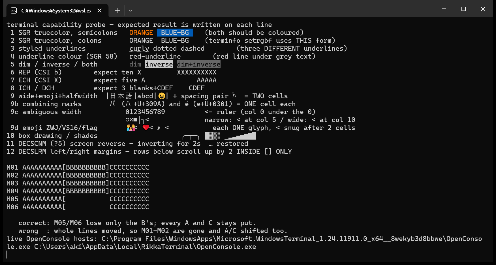
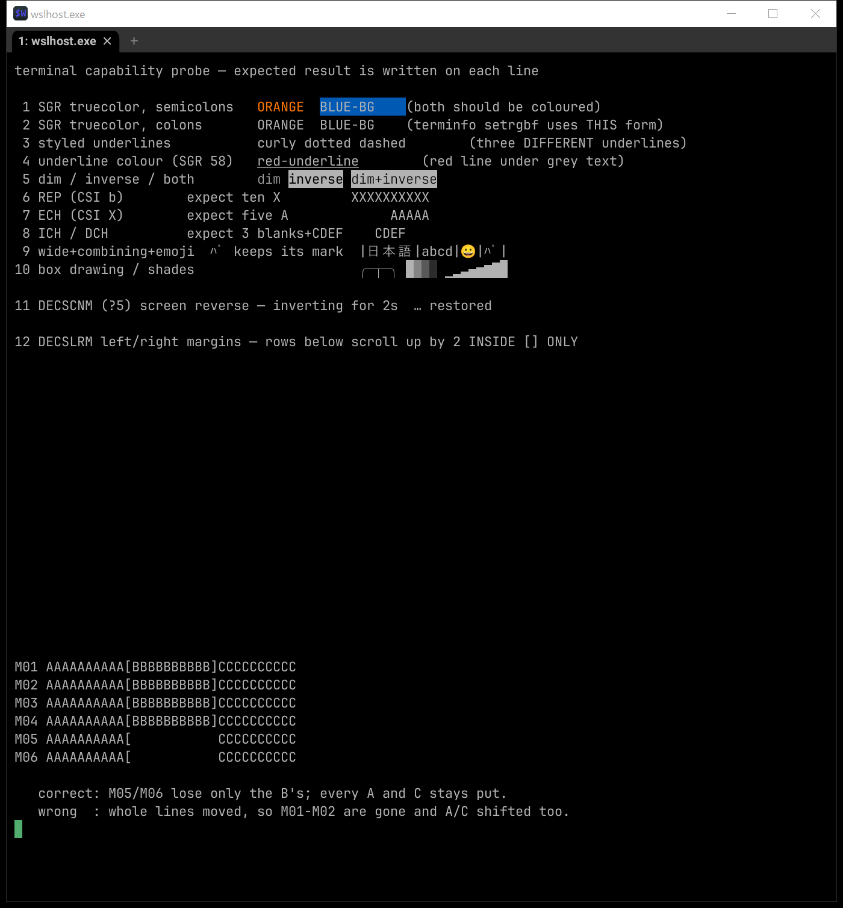
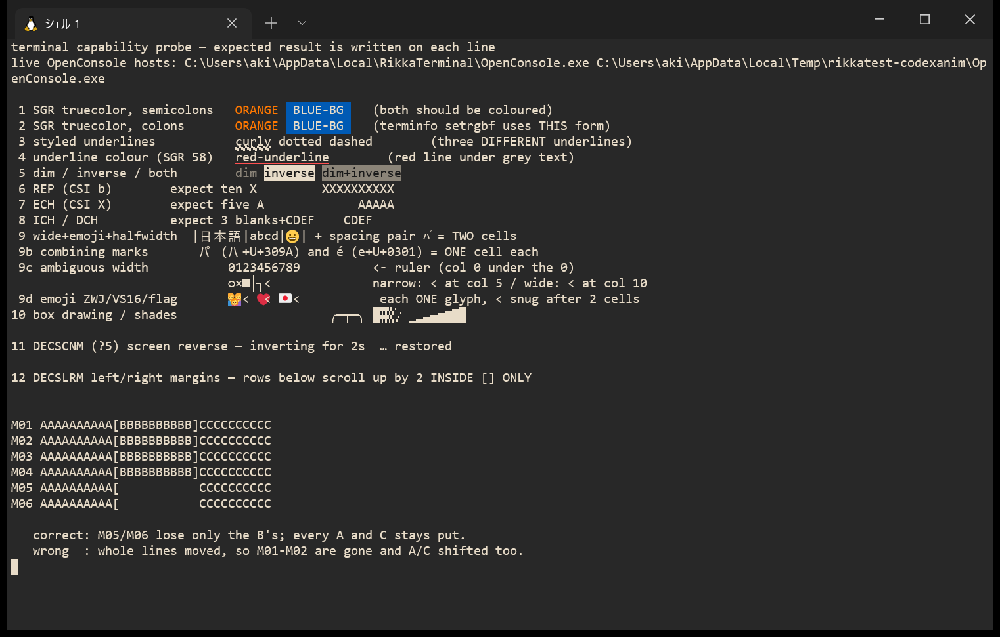
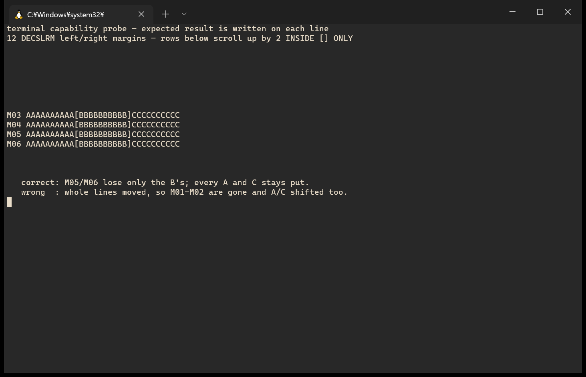
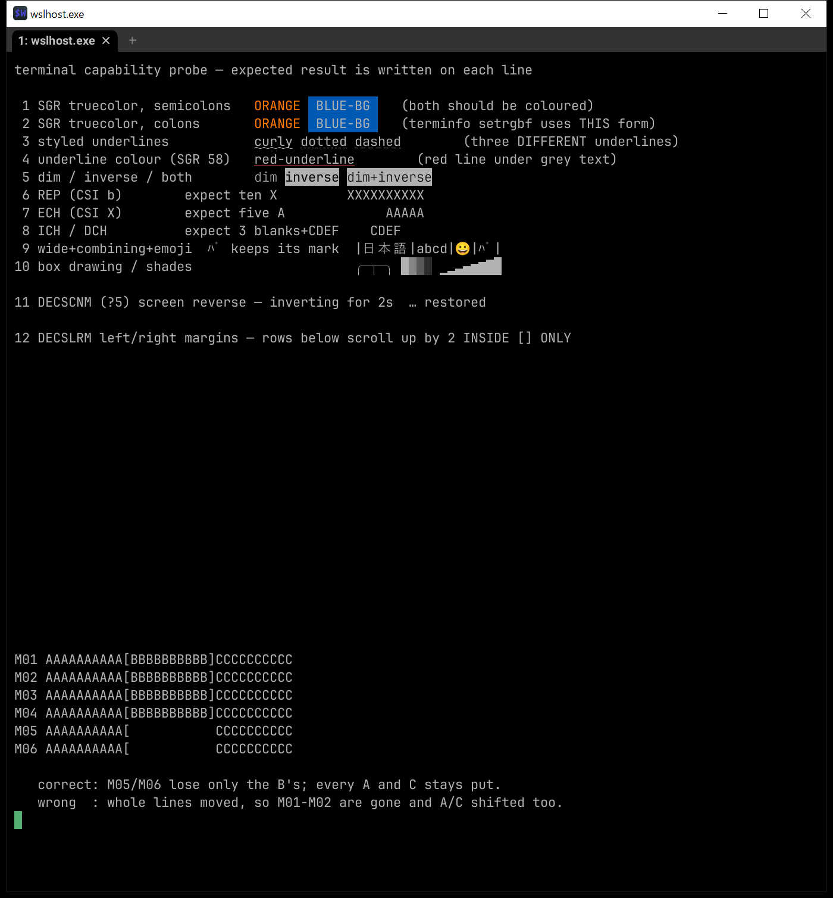
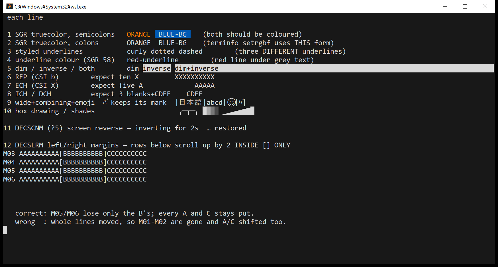
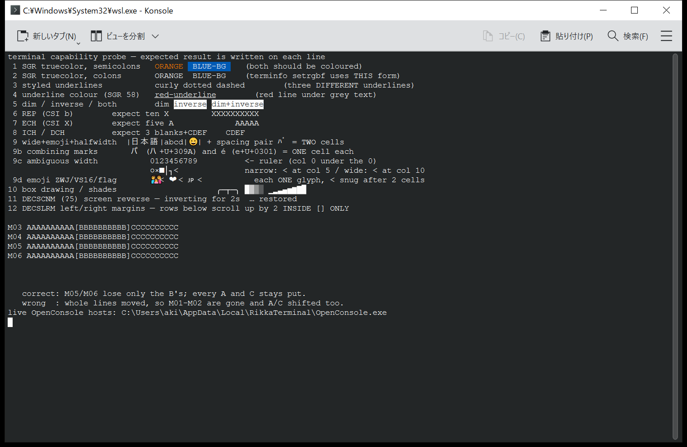

# Terminal capability comparison

RikkaTerminal answers to `TERM=xterm-ghostty` and reports itself as
`ghostty 1.3.1`, which is a promise: applications consult that terminfo entry
and send whatever it declares. This page is the evidence that the promise
holds, kept honest by a script anyone can re-run.

`terminal-capability-probe.sh` prints one line per capability, each judged by
**looking at the result** rather than by asking the terminal what it supports.
Every sequence it uses is one the `xterm-ghostty` entry declares.

```sh
bash docs/compat/terminal-capability-probe.sh
```

Captured on Windows 10 build 19045 — in-box `conhost.exe` 10.0.19041.4522,
sideloaded `OpenConsole.exe` 1.24.2607.10001 — with the shell reached through
`wsl.exe`.

## How these were captured, and where they fall short

Two things about this machine are worth stating up front, because both cost
us a wrong reading before they were understood.

**The font is not pinned across all three.** Windows Terminal and
RikkaTerminal are both Cascadia Mono 13pt. wezterm is **not**: on this machine
`wezterm.font('Cascadia Mono')` aborts the process inside DirectWrite —
`dwrote-0.11.0/src/font_family.rs:53: assertion failed: hr == 0` — and it does
so in the 2024 stable and the 2026 nightly alike, so it is the environment
rather than one build. The wezterm shots therefore use its default font at
11pt. Compare the capabilities, not the typography, and do not read anything
into glyph shapes in those two images.

**wezterm does not finish painting after the probe.** Line 11 restores from
DECSCNM with `?5l`, and everything printed before it can be left unpainted:
the first ten lines lose their foreground text while their backgrounds, the
red SGR 58 underline and the emoji are already on screen. Lines printed after
the toggle are fine.

The text is not lost. **Select the region and the glyphs are there** — the
cells are in wezterm's model and simply are not being drawn, and selecting
them forces the repaint that shows them. So a capability read from one of
these windows is still valid once it has been painted; what is at risk is
reading "missing" off a screenshot.

How long it stays unpainted tracks the ConPTY generation, and not in the
direction one would guess:

| Terminal | ConPTY it drove | After `?5l` |
|---|---|---|
| wezterm nightly | its own 1.22.2502.04002 | repainted within ~30s |
| wezterm nightly | our 1.24.2607.10001 | still unpainted; does not recover |
| RikkaTerminal | 1.22.2502.04002 | complete within 10s |
| RikkaTerminal | 1.24.2607.10001 | complete within 10s |

The **newer** host is the worse one for wezterm, while the same binary of
ours is unaffected by either. So this is not "old hosts drop things" and not
the host alone — it is wezterm's repainting, and a newer ConPTY apparently
stops handing it whatever it was relying on to invalidate the region.

Practically: force a repaint, or take two captures minutes apart and compare
them, before publishing one. And do not read a delta between two captures as
correctness — a window that is stuck shows no change at all, which is exactly
how the 1.24 row above first got mistaken for "stable".

RikkaTerminal driven by the in-box conhost has also been seen to sit
incomplete for a while. That case is not explained here; it is a much older
host and may be a different mechanism.

Captures here are taken with `PrintWindow(PW_RENDERFULLCONTENT)` against a
background window, from a DPI-aware process. Never with synthetic keystrokes:
those go to whatever holds focus, which is not necessarily the window under
test (see the warning at the top of `e2e/rikka-sixel-local.ps1`).

## Windows Terminal



## wezterm



`wezterm-gui.exe 20240203-110809-5046fc22` — the current stable install on
this machine.

## RikkaTerminal



## Results

| # | Capability | Windows Terminal | wezterm 20240203 | RikkaTerminal |
|---|------------|------------------|------------------|---------------|
| 1 | SGR truecolor, semicolons | yes | yes | yes |
| 2 | SGR truecolor, **colons** (`38:2:r:g:b`) | **no** | **no** | **yes** |
| 3 | Styled underlines (curly / dotted / dashed) | yes | **no** | yes |
| 4 | Underline colour (SGR 58) | yes | **no** | yes |
| 5 | dim / inverse / both | yes | yes | yes |
| 6 | REP (`CSI b`) | yes | yes | yes |
| 7 | ECH (`CSI X`) | yes | yes | yes |
| 8 | ICH / DCH | yes | yes | yes |
| 9 | Wide chars, combining marks, emoji | mark dropped from `ﾊﾟ` | composed | composed |
| 10 | Box drawing and shade blocks | font glyphs | font glyphs | drawn as geometry |
| 11 | DECSCNM (`?5`) screen reverse | yes | yes | yes |
| 12 | DECSLRM left/right margins | yes | yes | yes |

Rows 1, 2 and 4 are colour claims, so they were checked by sampling pixels
rather than by eye. The SGR 58 underline is the clearest: the probe asks for
`58:2::255:80:80`, and a row of exactly `(255, 80, 80)` runs the width of the
words `red-underline` — 182 px in Windows Terminal, 169 px in the wezterm
nightly, **zero** in wezterm 20240203.

wezterm 20240203 fails 2, 3 and 4 together, and they have one thing in
common: all three are **colon-separated SGR sub-parameters**. The semicolon
forms on line 1 work, and the plain `CSI 4 m` underline on line 4 appears —
it is only the colon syntax that is not parsed. See the aside below; the
nightly closes all three.

## On Windows the console host counts too

Every terminal here drives the shell through ConPTY, so what reaches its
engine is whatever the console host chose to forward. **Which host** matters
as much as the engine. RikkaTerminal ships `conpty.dll` and `OpenConsole.exe`
beside the exe and drives that pair directly; Windows Terminal bundles its
own; wezterm bundles its own; everything else falls back to the copy in
`C:\Windows\System32`.

That fallback is not equivalent. Below is the *same RikkaTerminal binary* —
the engine that produced the correct picture above — with the sideloaded pair
removed so it lands on the in-box conhost:



Three things are gone, and the same pixel sampling shows it:

- **DECSLRM.** The margin block comes out in the "wrong" shape the probe
  names: whole lines moved, `M01`/`M02` scrolled away, every `B` still
  present. The fence never arrives, so whether the engine implements the
  sequence stops mattering.
- **Colon-form truecolor.** Line 2 loses its colour entirely. The coloured
  band is one text row tall instead of two, with about half the coloured
  pixels (362 orange / 2073 blue, against 636 / 3922 through the sideloaded
  pair).
- **Underline colour.** Not one pixel of `(255, 80, 80)` survives, against
  143 through the sideloaded pair.

That last pair is worse than it looks for a terminal in our position. The
`xterm-ghostty` entry spells `setrgbf` with **colons**, so the colon form is
what an application actually sends once it believes the terminfo. On the
in-box conhost a terminal claiming that entry **cannot honour its own
terminfo**, however correct its engine is.

**This is one host build, not a rule about old hosts.** It is tempting to
read "in-box conhost is old, old hosts drop things" — but the measurements do
not support the general claim. DECSLRM survives three different bundled
generations:

| Host | Origin | DECSLRM |
|---|---|---|
| ConPTY 2024-era (no version resource) | wezterm 20240203 | forwarded |
| ConPTY 1.22.2502.04002 | wezterm nightly 20260716 | forwarded |
| ConPTY 1.24.2607.10001 | RikkaTerminal / Windows Terminal | forwarded |
| conhost 10.0.19041.4522 | in-box, Windows 10 19045 | **stripped** |

The wezterm nightly forwards it through a host **older** than the one we
ship. So this is the behaviour of that particular in-box build, not a
property of age.

It is still why the sideloaded pair is not a developer convenience. A host of
this vintage is not an artefact of one stale desktop: Server releases, the
LTSC and IoT LTSC channels, and machines carried on extended security updates
all keep the console host they shipped with, for support horizons measured in
years. Carrying `conpty.dll` + `OpenConsole.exe` makes the host a known
quantity instead of an environment variable.

## Asides

### wezterm nightly



`wezterm-gui.exe 20260716-195552-76b606ec` passes **all twelve**, including
the three colon-form rows the 2024 stable fails. That is the honest answer to
"does wezterm support this": the current code does, the shipping stable does
not.

It sits in an aside rather than the main table because the stable build is
what one gets by default — not because the nightly is hard to come by. There
is an installer for it, and it is carried by winget and by scoop's `versions`
bucket. It is absent from the GitHub releases page, though; the download
comes from the project's own site instead, which is enough of a detour that
someone who does not already know to look for it will turn back.

Worth recording that it does so through ConPTY **1.22.2502.04002**, an older
host than the 1.24.2607.10001 we carry.

### Alacritty (upstream, system conhost)



RikkaTerminal's engine is a vendored fork of `alacritty_terminal`, and DECSLRM
is one of the local additions: upstream keeps no margin state, and its vte
dependency does not even hand `CSI s` to the terminal with its parameters. So
the margin row is answerable from source rather than from this screenshot — it
would fail on the engine's own merits, host notwithstanding. The other rows
are the shared inheritance, and they match.

### Konsole for Windows (system conhost)



Konsole's own engine is not on trial here, for the same reason: taken on this
machine's system conhost, the screenshot cannot tell you what the engine
supports.

## Notes

Line 12 is the one that was missing until DECSLRM was implemented. tmux
scrolls a single pane by fencing the scroll into that pane's column band; a
terminal that ignores the fence scrolls the full width and drags the
neighbouring panes with it. Their content leaves the grid, and tmux —
believing the terminal did as it was told — never resends it, so panes that
produce no further output stay blank until a forced redraw. The probe's last
block reproduces exactly that: if margins are honoured only the `B`s vanish,
and every `A` and `C` stays put.
