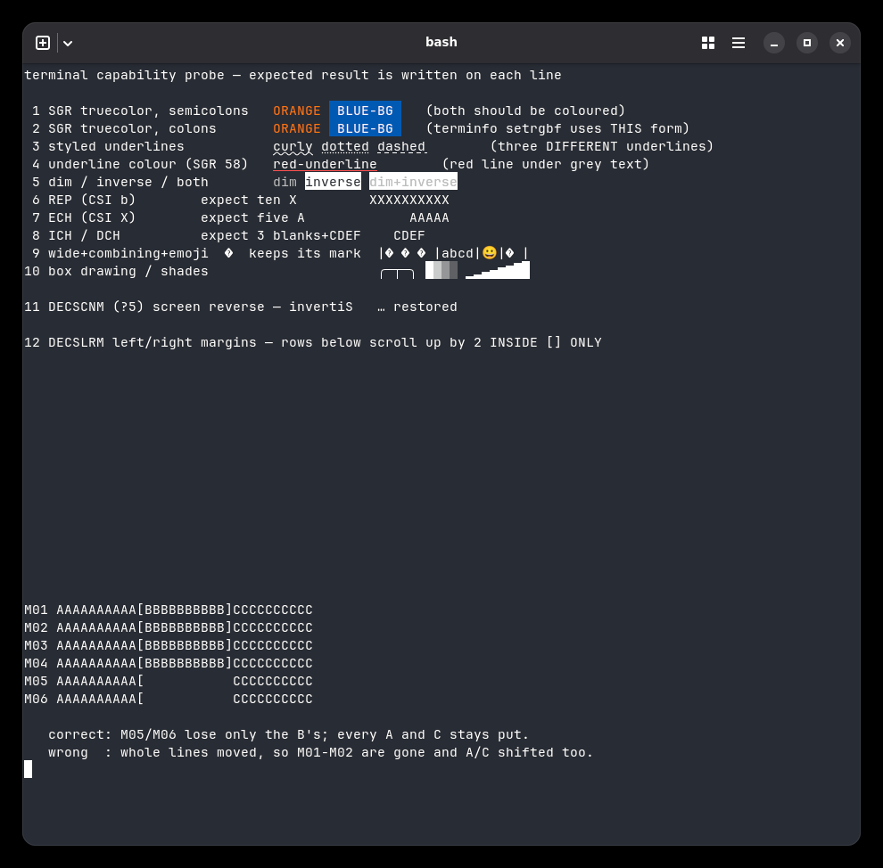
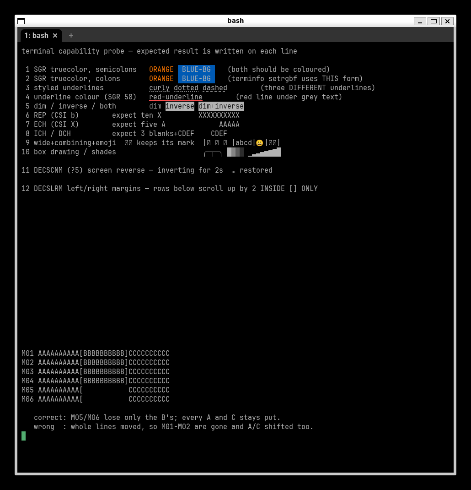
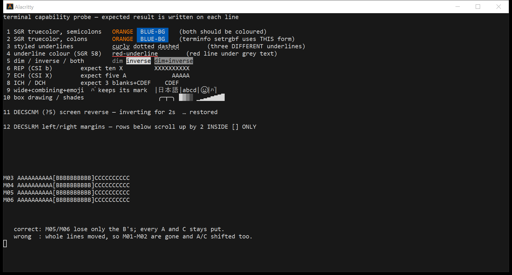
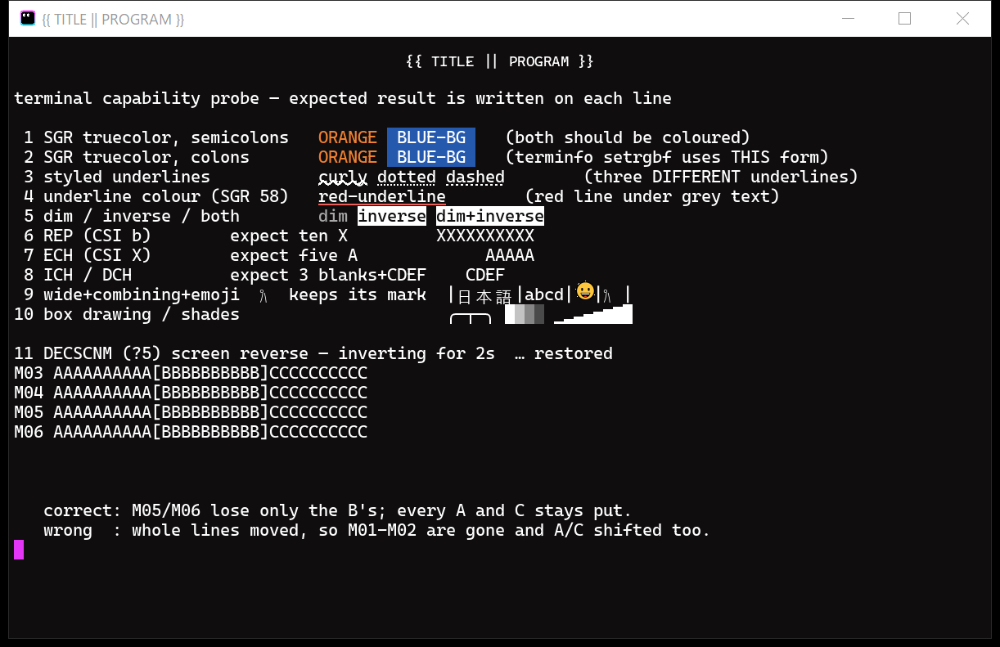
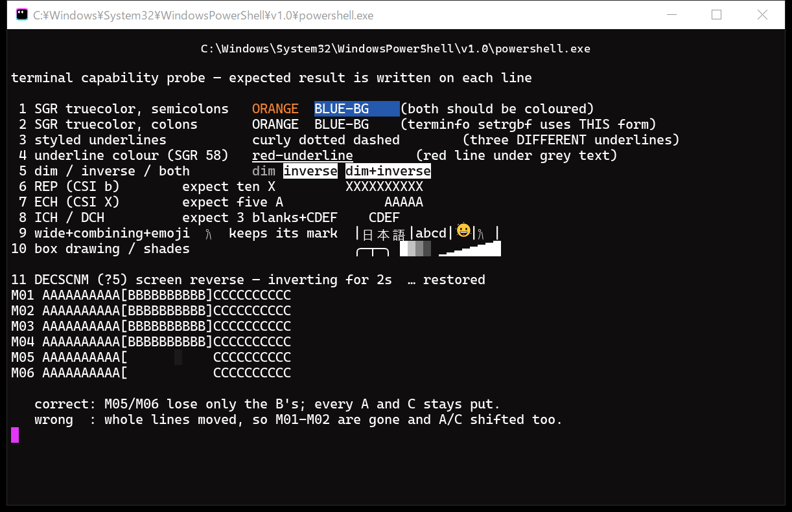

# Terminal capability comparison

RikkaTerminal answers to `TERM=xterm-ghostty` and reports itself as
`ghostty 1.3.1`, which is a promise: applications consult that terminfo entry
and send whatever it declares. This page is the evidence that the promise
holds, kept honest by a script anyone can re-run.

`terminal-capability-probe.sh` prints one line per capability, each judged by
**looking at the result** rather than by asking the terminal what it supports.
Every sequence it uses is one the `xterm-ghostty` entry declares.

```sh
bash docs/compat/terminal-capability-probe.sh
```

Captured on Windows 10 build 19045 — in-box `conhost.exe` 10.0.19041.4522,
sideloaded `OpenConsole.exe` 1.24.2607.10001 — with the shell reached through
`wsl.exe`.

## How these were captured, and where they fall short

Two things about this machine are worth stating up front, because both cost
us a wrong reading before they were understood.

**The font is not pinned across all three.** Windows Terminal and
RikkaTerminal are both Cascadia Mono 13pt. wezterm is **not**: on this machine
`wezterm.font('Cascadia Mono')` aborts the process inside DirectWrite —
`dwrote-0.11.0/src/font_family.rs:53: assertion failed: hr == 0` — and it does
so in the 2024 stable and the 2026 nightly alike, so it is the environment
rather than one build. The wezterm shots therefore use its default font at
11pt. Compare the capabilities, not the typography, and do not read anything
into glyph shapes in those two images.

**wezterm does not finish painting after the probe.** Line 11 restores from
DECSCNM with `?5l`, and everything printed before it can be left unpainted:
the first ten lines lose their foreground text while their backgrounds, the
red SGR 58 underline and the emoji are already on screen. Lines printed after
the toggle are fine.

The text is not lost. **Select the region and the glyphs are there** — the
cells are in wezterm's model and simply are not being drawn, and selecting
them forces the repaint that shows them. So a capability read from one of
these windows is still valid once it has been painted; what is at risk is
reading "missing" off a screenshot.

How long it stays unpainted tracks the ConPTY generation, and not in the
direction one would guess:

| Terminal | ConPTY it drove | After `?5l` |
|---|---|---|
| wezterm nightly | its own 1.22.2502.04002 | repainted by ~30s |
| wezterm nightly | our 1.24.2607.10001 | **never repainted** — still blank when the window was closed |
| RikkaTerminal | 1.22.2502.04002 | complete within 10s |
| RikkaTerminal | 1.24.2607.10001 | complete within 10s |

Ours is unaffected on either host, so this is not "old hosts drop things" and
not the host alone — it is wezterm's own repainting. The **newer** host is
the worse one for it, and on that host the region never came back at all.

**It is not confined to ConPTY either.** The same build on Linux, through a
real pty under WSLg, has shown the identical deficit — unchanged across
captures at 22s, 23s and 69s, and repainted by itself only when looked at
again much later. A second Linux run with the same command painted correctly
from the start. A system font had been added in between, but that was not
isolated cleanly enough to blame it, so the trigger is not established.

The shape is the same on both platforms — lines printed before the `?5l` lose
their foreground while backgrounds and emoji stay, and anything that forces a
redraw brings the text back. What differs is whether it ever recovers on its
own: minutes on Linux, about thirty seconds on the older ConPTY, and never on
the newer one.

Treat it as a property of wezterm's rendering to work around when capturing,
not as a finding about any console host.

Practically: force a repaint, or take two captures minutes apart and compare
them, before publishing one. And do not read a delta between two captures as
correctness — a window that is stuck shows no change at all, which is exactly
how the 1.24 row above first got mistaken for "stable".

RikkaTerminal driven by the in-box conhost has also been seen to sit
incomplete for a while. That case is not explained here; it is a much older
host and may be a different mechanism.

Captures here are taken with `PrintWindow(PW_RENDERFULLCONTENT)` against a
background window, from a DPI-aware process. Never with synthetic keystrokes:
those go to whatever holds focus, which is not necessarily the window under
test (see the warning at the top of `e2e/rikka-sixel-local.ps1`).

## Windows Terminal


## wezterm


`wezterm-gui.exe 20240203-110809-5046fc22` — the current stable install on
this machine.

## RikkaTerminal


## Results

| # | Capability | Windows Terminal | wezterm 20240203 | RikkaTerminal |
|---|------------|------------------|------------------|---------------|
| 1 | SGR truecolor, semicolons | yes | yes | yes |
| 2 | SGR truecolor, **colons** (`38:2:r:g:b`) | **no** | **no** (host) | **yes** |
| 3 | Styled underlines (curly / dotted / dashed) | yes | **no** (host) | yes |
| 4 | Underline colour (SGR 58) | yes | **no** (host) | yes |
| 5 | dim / inverse / both | yes | yes | yes |
| 6 | REP (`CSI b`) | yes | yes | yes |
| 7 | ECH (`CSI X`) | yes | yes | yes |
| 8 | ICH / DCH | yes | yes | yes |
| 9 | Wide chars, combining marks, emoji | mark dropped from `ﾊﾟ` | composed | composed |
| 10 | Box drawing and shade blocks | font glyphs | font glyphs | drawn as geometry |
| 11 | DECSCNM (`?5`) screen reverse | yes | yes | yes |
| 12 | DECSLRM left/right margins | yes | yes | yes |

Rows 1, 2 and 4 are colour claims, so they were checked by sampling pixels
rather than by eye. The SGR 58 underline is the clearest: the probe asks for
`58:2::255:80:80`, and a row of exactly `(255, 80, 80)` runs the width of the
words `red-underline` — 182 px in Windows Terminal, **zero** in wezterm
20240203.

**The wezterm column is not measuring wezterm.** Rows 2, 3 and 4 are all
colon-separated SGR sub-parameters, and the obvious reading is that its
parser does not handle the colon syntax. That reading is wrong. Run the
**same build** on Linux, where ConPTY is not in the path at all, and all
three pass:

| | rows 2 / 3 | SGR 58 red pixels |
|---|---|---|
| wezterm 20240203, Windows, its own 2024-era ConPTY | fail | **0** |
| wezterm 20240203, Linux (AppImage, real pty) | pass | **117** |

Same binary, same probe. What differs is the console host, so the strip
belongs to the 2024-era ConPTY pair wezterm bundles — not to its engine. A
Windows user does see the failures, which is why the row stays in the table,
but nothing here says anything about wezterm's own VT parsing. The screenshot
behind those numbers is in [an aside](#wezterm-on-linux-the-colon-form-control),
kept out of the way because it cannot be read as a full capability run.

That also joins up with the section below: the in-box conhost drops **the
same three things**. Stripping colon-form SGR sub-parameters looks like a
trait of older ConPTY hosts generally, fixed somewhere between the pair
wezterm bundles and 1.22.2502.04002.

## On Windows the console host counts too

Every terminal here drives the shell through ConPTY, so what reaches its
engine is whatever the console host chose to forward. **Which host** matters
as much as the engine. RikkaTerminal ships `conpty.dll` and `OpenConsole.exe`
beside the exe and drives that pair directly; Windows Terminal bundles its
own; wezterm bundles its own.

For the rest, "falls back to the in-box conhost" is only the end of the
story. Terminals in this family (alacritty, rio) load the sideload DLL with
a bare `LoadLibrary("conpty.dll")`, and when the exe's own directory has
none, **that search walks `PATH`**. On this machine WezTerm's install dir is
on `PATH`, so today a stock alacritty and a stock rio both come up hosted by
`C:\Program Files\WezTerm\OpenConsole.exe` — spotted in Task Manager, then
confirmed from the process tree. Installing one terminal silently changed
which console host every other sideload-capable terminal runs on. Only when
no `conpty.dll` is findable anywhere does the in-box conhost actually
apply. (The alacritty capture below predates WezTerm's installation on this
machine, so its in-box attribution held at the time it was taken; it would
not reproduce today without scrubbing `PATH`.)

That fallback is not equivalent. Below is the *same RikkaTerminal binary* —
the engine that produced the correct picture above — with the sideloaded pair
removed so it lands on the in-box conhost:


Three things are gone, and the same pixel sampling shows it:

- **DECSLRM.** The margin block comes out in the "wrong" shape the probe
  names: whole lines moved, `M01`/`M02` scrolled away, every `B` still
  present. The fence never arrives, so whether the engine implements the
  sequence stops mattering.
- **Colon-form truecolor.** Line 2 loses its colour entirely. The coloured
  band is one text row tall instead of two, with about half the coloured
  pixels (362 orange / 2073 blue, against 636 / 3922 through the sideloaded
  pair).
- **Underline colour.** Not one pixel of `(255, 80, 80)` survives, against
  143 through the sideloaded pair.

That last pair is worse than it looks for a terminal in our position. The
`xterm-ghostty` entry spells `setrgbf` with **colons**, so the colon form is
what an application actually sends once it believes the terminfo. On the
in-box conhost a terminal claiming that entry **cannot honour its own
terminfo**, however correct its engine is.

**This is one host build, not a rule about old hosts.** It is tempting to
read "in-box conhost is old, old hosts drop things" — but the measurements do
not support the general claim. Worse, "survives" turned out to be two
different things wearing one word. Rio is the instrument that splits them:
its engine has **no margin support at all** (proven on our pass-through host,
where its margin block comes out wrong), so whatever correctness appears on
another host was manufactured *by that host*. The same rio binary, three
hosts:

| Host | Origin | DECSLRM strategy | rio's margin block |
|---|---|---|---|
| conhost 10.0.19041.4522 | in-box, Windows 10 19045 | **stripped** | wrong |
| ConPTY 2024-era | wezterm 20240203 | **applied by the host** — margins are fenced in the host's own buffer and the re-emitted output is already correct | **correct**, engine notwithstanding |
| ConPTY 1.24.2607.10001 | RikkaTerminal / Windows Terminal | **forwarded** — the sequence reaches the terminal, and the engine must implement it | wrong |

Three generations, three strategies: strip, interpret, forward. The earlier
version of this table said "forwarded" for all of them — wezterm could not
expose the difference, because its engine implements margins either way; a
terminal that cannot is what makes the host's own hand visible.

Two consequences worth spelling out. On a modern, forwarding host,
engine-side DECSLRM is *mandatory* — which is exactly why the karo-pane wipe
needed an engine fix and not a host swap. And an old interpreting host can
make a margin-less terminal LOOK margin-capable: a capability screenshot
taken through it says nothing about the engine.

It is still why the sideloaded pair is not a developer convenience. A host of
this vintage is not an artefact of one stale desktop: Server releases, the
LTSC and IoT LTSC channels, and machines carried on extended security updates
all keep the console host they shipped with, for support horizons measured in
years. Carrying `conpty.dll` + `OpenConsole.exe` makes the host a known
quantity instead of an environment variable.

## The terminal we claim to be

The page opens by calling `TERM=xterm-ghostty` a promise. The control for that
is ghostty itself, answering the same probe:



**Twelve of twelve**, with the SGR 58 underline measuring 117 px of exactly
`(255, 80, 80)` — the same reading RikkaTerminal gives. So the entry we claim
is one the reference implementation honours in full, and claiming it does not
overstate what we do.

Row 9 is the one worth looking at closely. ghostty **keeps the mark on
`ﾟ`**: the half-width katakana and its combining semi-voiced mark come out
composed, the same as RikkaTerminal and unlike Windows Terminal, which drops
the mark. That is the row where the three-way comparison actually has
something to say, so it is worth having real glyphs rather than tofu here.

Details worth knowing before re-running it:

- This is `Ghostty 1.3.0-dev` from the `mkasberg/ghostty-ubuntu` PPA, run
  under WSLg. We report ourselves as `ghostty 1.3.1`.
- The **AppImage build will not start here**: ghostty requires OpenGL 4.3,
  WSLg's d3d12 path offers 3.3, and forcing `GALLIUM_DRIVER=llvmpipe` fails
  earlier still with "Could not initialize EGL display". The PPA build runs.
  A ghostty process being alive is not evidence it rendered — check the
  window, which shows "Oh, no. Unable to acquire an OpenGL context" when it
  did not.
- WSL here ships no CJK fonts, so row 9 came out as replacement glyphs until
  one was added. No root needed: copy a font from `/mnt/c/Windows/Fonts`
  (`msgothic.ttc` was used) into `~/.local/share/fonts` and run `fc-cache -f`.
- The DECSCNM label on line 11 comes out truncated in these captures, and
  differently between runs. Not investigated, and not claimed as ghostty
  behaviour — it looks like the capture catching a repaint. Nothing else on
  the line depends on it.

## Asides

### wezterm nightly


`wezterm-gui.exe 20260716-195552-76b606ec` passes **all twelve**, including
the three colon-form rows the 2024 stable fails. That is the honest answer to
"does wezterm support this": the current code does, the shipping stable does
not.

It sits in an aside rather than the main table because the stable build is
what one gets by default — not because the nightly is hard to come by. There
is an installer for it, and it is carried by winget and by scoop's `versions`
bucket.

Two things keep people on the stable build anyway, and neither is difficulty.
It is absent from the GitHub releases page, so the download comes from the
project's own site — a detour rather than an obstacle. And it is called
*nightly*, which reads as "may be broken today" regardless of whether it is;
a label like that turns people around before they ever look at what is in the
build. Between the detour and the word, someone not already looking for it
goes back — which is why the stable build is the one the main table measures,
even though the code has moved on.

Worth recording that it does so through ConPTY **1.22.2502.04002**, an older
host than the 1.24.2607.10001 we carry.

### wezterm on Linux (the colon-form control)



The `20240203-110809-5046fc22` AppImage — the same build as the Windows
stable — run under WSLg, so the shell is reached through a real pty and no
console host is involved. Rows 2, 3 and 4 pass here and fail on Windows,
which is what pins those failures on the bundled ConPTY rather than on
wezterm.

**Do not read the other rows off this image.** The AppImage sandbox has no
CJK fonts, so row 9's `日本語` and `ﾊﾟ` come out as replacement boxes; that
is the font situation in a stripped container, not the terminal dropping
anything. wezterm says as much on startup ("You may wish to install
additional fonts"). The window is also smaller and in a different font than
the shots above. This picture exists to answer one question, and it is not
comparable on the rest.

### Alacritty upstream — and what our fork actually adds

RikkaTerminal's engine is a vendored fork of `alacritty_terminal`, so upstream
Alacritty is the closest thing to a control for our own engine. It is worth
unmasking, and it can be: Alacritty loads a sideloaded `conpty.dll` when one
sits beside the exe and falls back to the system API otherwise
(`tty/windows/conpty.rs`). The install ships no pair, so by default it runs on
the in-box conhost — but drop ours next to a copy of `alacritty.exe` and the
engine comes out from behind the host.

Same binary, same window, two hosts:

| | rows 2 / 3 | SGR 58 red px | row 12 DECSLRM |
|---|---|---|---|
| in-box conhost 10.0.19041.4522 | fail | **0** | fail |
| our `OpenConsole.exe` 1.24.2607.10001 | pass | **312** | **still fails** |



On a modern host upstream passes **eleven of twelve**. The colon-form rows
were never its fault, exactly as with wezterm. What does not come back is
DECSLRM, and that one is the engine's own: upstream keeps no margin state,
and its `vte` dependency does not even hand `CSI s` to the terminal with its
parameters. Both are local additions here — which makes this screenshot the
honest measure of what the fork contributes, rather than the assertion that
used to stand in this section.

For contrast, the same binary on the in-box conhost, which is what a user
gets by default:


### Rio (0.4.2 alpha, unmasked on our pair)



Rio's PTY layer does the same `LoadLibrary("conpty.dll")` dance as alacritty,
ships no pair — and on this machine therefore comes up on **WezTerm's**
2024-era host via the `PATH` walk described above. Dropped next to our
1.24.2607 pair instead (child process verified), its engine comes out from
behind the host: **eleven of twelve**, including the colon-form SGR rows
(689 orange px across both truecolor lines, 312 px of exact `(255, 80, 80)`
under `red-underline`).

The one failure is DECSLRM, in the same "wrong" shape as upstream alacritty —
which is no coincidence: rio's parser (`copa`) is a vte fork, and like
upstream it keeps no margin state. The probe also shows two alpha rough
edges that are rio's own: the `12 DECSLRM` header line lands somewhere else
entirely (cursor-addressing disagreement about the grid height), and the
window title renders its literal `{{ TITLE || PROGRAM }}` template.

The stock install, on WezTerm's host via the `PATH` walk, is the mirror
image — and the measurement that split the generation table above:



Colon-form SGR dies (orange in row 1 only, zero red pixels) exactly as that
host always strips it, yet the margin block comes out **correct** — the 2024
host applied DECSLRM itself and handed rio pre-fenced output. Same binary,
opposite verdicts on rows 2/3/4 and row 12, purely from which host sat in
between.

Capture notes: `-e` and every custom `[shell]` config exit instantly in this
build, so both probes were typed into the default shell by hand; the
captures are `PrintWindow` from behind, focus untouched.

### Konsole for Windows (system conhost)


Konsole's own engine is not on trial here, for the same reason: taken on this
machine's system conhost, the screenshot cannot tell you what the engine
supports.

## Notes

Line 12 is the one that was missing until DECSLRM was implemented. tmux
scrolls a single pane by fencing the scroll into that pane's column band; a
terminal that ignores the fence scrolls the full width and drags the
neighbouring panes with it. Their content leaves the grid, and tmux —
believing the terminal did as it was told — never resends it, so panes that
produce no further output stay blank until a forced redraw. The probe's last
block reproduces exactly that: if margins are honoured only the `B`s vanish,
and every `A` and `C` stays put.
